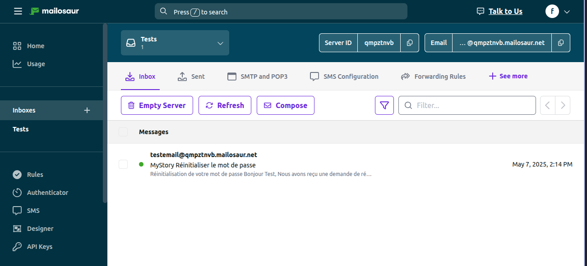
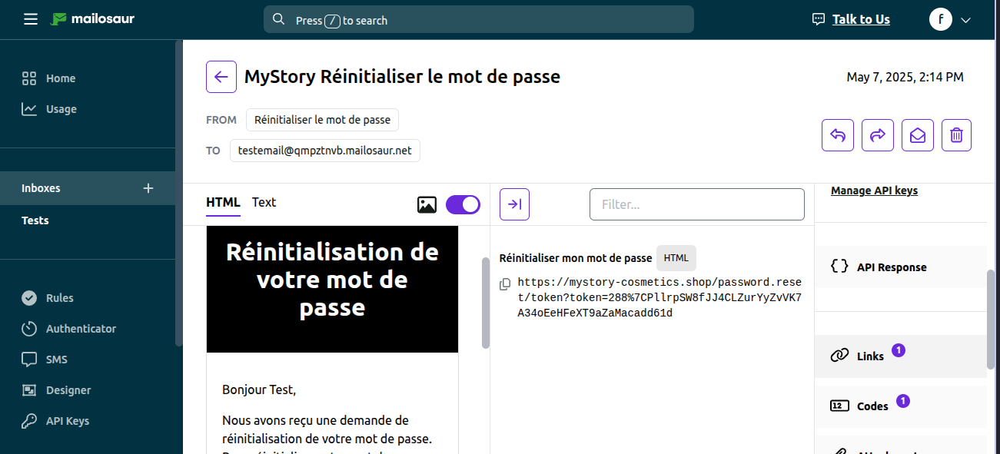

# 💚 MyStore Forgot Password E2E Testing Project

🪭 This project automates the **Forgot Password** feature of the [MyStore Cosmetics](https://mystory-cosmetics.shop) web app using Cypress (JavaScript) 🌲, Cucumber (Gherkin) 🥒, and Mailosaur 🦕.

---

## 📁 Project Structure

```
cypress/
├── e2e/
│   ├── features/                  # Gherkin feature files
│   │   └── forgotPassword.feature
│   └── stepDef/                   # Step definitions for features
│       └── forgotPassword.js
├── pageObject/
│   ├── pageActions/               # Encapsulated UI interactions
│   │   └── forgotPassword.js
│   └── pageElements/              # Selectors used by pageActions
│       └── forgotPassword.js
├── fixtures/
│   └── dataPassword/
│       └── mailosaur.json         # Email and test data
└── support/                       # Cypress support files
```

---

## 🧰 Technologies Used

- 🌲 **Cypress** `^13.17.0`
- 🥒 **Cucumber Preprocessor** `^4.3.1`
- 🦕 **Mailosaur** `^2.14.0`
- 📑 **Mochawesome Reporter** `^3.8.1`

---

## 🔑 Environment Setup

### 1. **Install dependencies**

```bash
npm install
```

### 2. **Set Mailosaur API Key**

Make sure to include your Mailosaur API key in `cypress.config.js`:

```js
env: {
  MAILOSAUR_API_KEY: "your-api-key"
}
```

---

## ✅ Test Scenario Overview

**File**: `cypress/e2e/features/forgotPassword.feature`

```gherkin
Feature: Forgot Password
  Scenario: User successfully resets password
    Given I open the login page
    When I click on "Mot de passe oublié ?"
    And I enter my email address and submit the reset form
    Then I should see link and a confirmation message
    When I retrieve the password reset link from Mailosaur
    Then I should be on the "Nouveau mot de passe" page
    When I enter a new password and confirm it
    Then I should be redirected to the login page
    When I log in with my email and the new password
    Then I should be redirected to the home page
```

---

## 🔍 Step Definition Highlights

**File**: `cypress/e2e/stepDef/forgotPassword.js`

- Uses `cypress-cucumber-preprocessor` for BDD steps.
- Encapsulates all actions in the `forgotPassword` page object.
- Mailosaur is used to capture the reset email and extract the link.

---

## 📬 Mailosaur Integration

**File**: `forgotPassword.js` (pageActions)

```js
cy.mailosaurGetMessage(serverId, {
  sentTo: emailMailosaur,
  subject: 'MyStory Réinitialiser le mot de passe'
})
.then(email => {
  const resetLink = email.html.links[0].href;
  cy.visit(resetLink);
});
```

**Test Email Config**:

```json
// fixtures/dataPassword/mailosaur.json
{
  "mailosaur": {
    "email": "testemail@qmpztnvb.mailosaur.net"
  }
}
```


---

## 📦 Run the Tests

```bash
npx cypress open
npx cypress run
```

---

## 📊 Test Report

HTML report generated with **Mochawesome**.

```js
reporter: 'cypress-mochawesome-reporter',
reporterOptions: {
  charts: true,
  reportPageTitle: 'MyStore🦩',
  embeddedScreenshots: true,
  inlineAssets: true,
  html: true
}
```

---

## 🧱 Cypress Config Highlights

**File**: `cypress.config.js`

```js
baseUrl: 'https://mystory-cosmetics.shop',
specPattern: "cypress/e2e/features/**/*.feature",
excludeSpecPattern: '**/*.{js,ts}',
chromeWebSecurity: false,
```

---

## 💡 Notes

- `generatePassword()` creates a random 9-character alphanumeric password.
- All page interaction logic is abstracted in `pageActions`.
- Test reliability is improved with strategic waits and Mailosaur timeout settings.

---

## ✍️ Author

Maintained by QA Automation **Salhi Fayza 🌻**
🔐 Mailosaur Server ID: `yourServerID`
